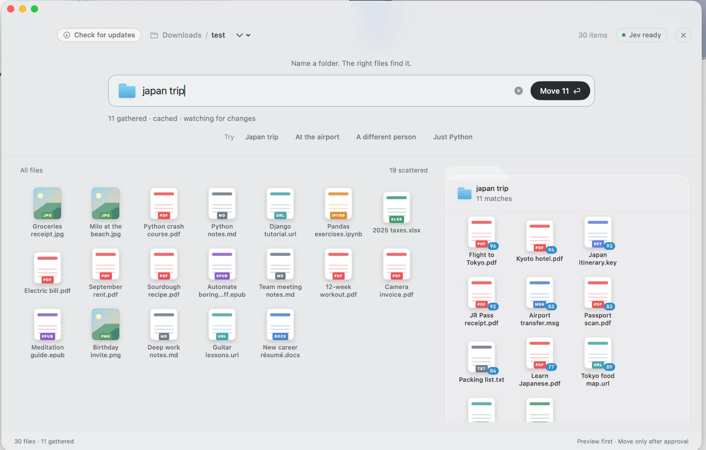

# Living Folders

**Name a folder in plain language. The files walk in by themselves.**

A native macOS app. Open any folder, start typing what you want — `screenshots from last week`, `tax stuff`, `python tutorials` — and the matching files gather as you type. When it looks right, approve. The folder becomes real.



SwiftUI. No web view, no server, no account.

**You need a Jev API key.** The matching is done by Jev — that is the part that knows a file called `Kyoto hotel.pdf` belongs in `japan trip` and `2025 taxes.xlsx` does not. Get a key at **[console.typesafe.ai](https://console.typesafe.ai/home)**, where you can also watch your usage, then add it in Settings (⌘,). Nothing gathers without it.

---

## Ask your AI agent to install it

If you already have a coding agent on your Mac — **Codex**, **Claude Code**, **Muse**, **Grok bot**, or anything else that can run shell commands — copy the block below and paste it into your agent. It has everything the agent needs.

````markdown
Please install Living Folders on my Mac.

Repo: https://github.com/diegocp01/living-folders.git

```bash
git clone https://github.com/diegocp01/living-folders.git
cd living-folders
./build.sh --open
```

That is the whole install. `build.sh` figures out the rest:

- If I have Xcode, it builds the app from source.
- If I do not have Xcode, it downloads the prebuilt app instead.

Either way it produces `build/LivingFolders.app` and opens it. Do not install
Xcode, Homebrew or anything else on my machine — you do not need to, and I
have not asked you to. If the script fails, show me its output and stop.

The app needs a Jev API key before it can gather anything. Tell me to get one
from https://console.typesafe.ai/home and to paste it into the app's Settings
myself. Do not ask me to paste the key to you, and do not put it in a file, a
shell command or an environment variable on my behalf.

The app itself never touches my files without showing me the exact commands
and waiting for my approval.
````

Prefer to do it yourself? See [Install](#install).

## What makes it safe

This app moves real files, so the whole design is built around you seeing it coming.

- **Nothing happens until you approve.** Typing only previews. An approve sheet shows the exact items and the exact shell commands before anything runs.
- **Nothing is ever overwritten.** The move uses `mv -n`, which refuses to clobber an existing file.
- **Nothing is ever deleted.** There is no delete path in the app at all.
- **No surprise destinations.** The name you type is sanitised into a single path component — `/`, `:` and leading dots are stripped — and the app will not move a folder into itself.
- **Your files are never uploaded.** Jev is sent filenames, file kinds, sizes and modification dates — never file contents. Nothing leaves your Mac except that list of names.

The commands you approve are always just these two:

```
/bin/mkdir -p '<folder you opened>/<name you typed>'
/bin/mv -n '<item 1>' '<item 2>' … '<folder you opened>/<name you typed>'
```

---

## How it works

1. **Open a folder.** Use *Open Folder…*, drag one onto the window, or pick a recent one. The app lists the visible top-level files and folders.
2. **Type a name.** Every keystroke reclassifies. A space or a paste dispatches instantly; an unfinished word waits 90 ms. Cards fly between the desktop and the folder pane in a 300 ms spring.
3. **Approve.** Press ⌘↩ or click *Move N*, read the sheet, confirm.

### How it decides what belongs

**Jev (this is the product).** Your folder name and the list of files in the open folder — names, kinds, sizes, dates, never contents — go to Jev (`jev-latest`, one `noul` question per item), which decides what genuinely belongs. This is what lets `tax stuff` find a W-2 and `Japan trip` find a hotel confirmation without either word appearing in the filename.

Each gathered file carries the confidence Jev gave it, so you can see *how* sure it was before you approve. Results are cached per folder name and the app keeps watching the folder, so adding a file re-runs only what changed.

> **If Jev is unreachable, gathering stops and shows the error.** There is no offline mode today. A local rule-based classifier ships in the source (`LocalClassifier`) but nothing currently calls it.

**Setting your key.** Keys and usage both live at [console.typesafe.ai](https://console.typesafe.ai/home). The app reads the first one it finds, in this order:

| Where | Notes |
|---|---|
| `.env` beside the repo | `TYPESAFE_API_KEY=…` — gitignored, never committed |
| `TYPESAFE_API_KEY` in your environment | overrides Settings |
| Settings (⌘,) | the normal way; stored in your macOS user defaults |

Settings tells you which of the three is currently winning, so a forgotten `.env` cannot silently override the key you just typed.

---

## Install

```bash
git clone https://github.com/diegocp01/living-folders.git
cd living-folders
./build.sh --open
```

You end up with `build/LivingFolders.app`, open and ready. **You do not need Xcode.**

Then open Settings (⌘,) and paste your Jev API key. Get one at [console.typesafe.ai](https://console.typesafe.ai/home) — same place you track usage. Nothing gathers without it.

`build.sh` picks a path for you:

| Your Mac | What happens |
|---|---|
| Xcode installed | Builds from source |
| Xcode not installed | Downloads the prebuilt app from [Releases](https://github.com/diegocp01/living-folders/releases/latest) |

Force either one with `./build.sh --from-source` or `./build.sh --download`.

<details>
<summary>Why a download path exists</summary>

SwiftUI's `@State` is a Swift macro, and macro plugin binaries ship inside `Xcode.app`. A Mac with only the Command Line Tools has `swift` but cannot expand those macros, so the app genuinely cannot be compiled there — no build flag works around it. Rather than make everyone install a multi-gigabyte Xcode, CI builds the app on a macOS runner that has Xcode and publishes it, and `build.sh` fetches that.

</details>

To develop in Xcode, run `open Package.swift` and use the `LivingFolders` scheme.

To launch straight into a folder:

```bash
open build/LivingFolders.app --args ~/Downloads
```

## Test

```bash
swift test
```

The suite covers the classifier rules, folder-name sanitising, shell quoting, and a real `mkdir` + `mv` run inside a temporary directory.

---

## Project layout

| Path | What's in it |
|---|---|
| `Sources/LivingFoldersCore/` | `FolderScanner`, `LocalClassifier`, `JevClassifier`, `ShellMover` — no UI, fully testable |
| `Sources/LivingFolders/` | SwiftUI app: welcome screen, card field, prompt bar, approve sheet |
| `Tests/LivingFoldersCoreTests/` | Offline tests |
| `build.sh` | Assembles `build/LivingFolders.app` |
