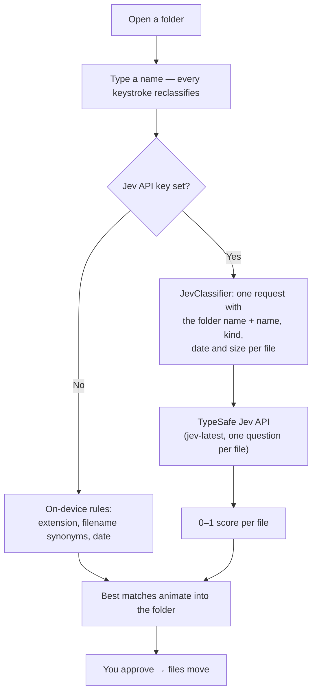

# Living Folders

**Name a folder in plain language. The files walk in by themselves.**

A native macOS app. Open any folder, start typing what you want — `screenshots from last week`, `tax stuff`, `python tutorials` — and the matching files gather as you type. When it looks right, approve. The folder becomes real.


SwiftUI. No web view, no server, no account, no network unless you ask for it.

---

## Ask your AI agent to install it

If you already have a coding agent on your Mac — **Codex**, **Claude Code**, **Muse**, **Grok bot**, or anything else that can run shell commands — copy the block below and paste it into your agent. It has everything the agent needs.

````markdown
Please install Living Folders on my Mac.

Repo: https://github.com/diegocp01/living-folders.git

```bash
git clone https://github.com/diegocp01/living-folders.git
cd living-folders
./build.sh --open
```

That is the whole install. `build.sh` figures out the rest:

- If I have Xcode, it builds the app from source.
- If I do not have Xcode, it downloads the prebuilt app instead.

Either way it produces `build/LivingFolders.app` and opens it. Do not install
Xcode, Homebrew or anything else on my machine — you do not need to, and I
have not asked you to. If the script fails, show me its output and stop.

The app itself never touches my files without showing me the exact commands
and waiting for my approval.
````

Prefer to do it yourself? See [Install](#install).

## What makes it safe

This app moves real files, so the whole design is built around you seeing it coming.

- **Nothing happens until you approve.** Typing only previews. An approve sheet shows the exact items and the exact shell commands before anything runs.
- **Nothing is ever overwritten.** The move uses `mv -n`, which refuses to clobber an existing file.
- **Nothing is ever deleted.** There is no delete path in the app at all.
- **No surprise destinations.** The name you type is sanitised into a single path component — `/`, `:` and leading dots are stripped — and the app will not move a folder into itself.
- **No network by default.** Classification runs on your Mac. The optional cloud path is off unless you set a key.

The commands you approve are always just these two:

```
/bin/mkdir -p '<folder you opened>/<name you typed>'
/bin/mv -n '<item 1>' '<item 2>' … '<folder you opened>/<name you typed>'
```

---

## How it works

1. **Open a folder.** Use *Open Folder…*, drag one onto the window, or pick a recent one. The app lists the visible top-level files and folders.
2. **Type a name.** Every keystroke reclassifies. A space or a paste dispatches instantly; an unfinished word waits 90 ms. Cards fly between the desktop and the folder pane in a 300 ms spring.
3. **Approve.** Press ⌘↩ or click *Move N*, read the sheet, confirm.

### How it decides what belongs

**On-device rules (the default).** No network. Each item is scored on four signals:

| You type | It matches on |
|---|---|
| `photos`, `screenshots`, `PDFs`, `installers`, `code`, `music` | file type, by extension |
| `trip`, `taxes`, or any topic | filename, with synonyms (`trip` → flight, hotel, itinerary, passport; `taxes` → irs, w2, 1099) |
| `today`, `this week`, `last month`, `old` | modification date |
| `folders`, `files` | directories or regular files |

**Jev (optional).** Set `TYPESAFE_API_KEY` in the repo's `.env`, your environment, or the app's Settings (checked in that order). Each folder name is then sent to Jev (`jev-latest`, one `noul` question per item) instead of the on-device rules.

> This path is implemented but has **not** been exercised against the live API. Treat it as untested.

**What Jev actually sees.** Per file, only four things: the filename, the kind (extension), the modified date, and the size. The instruction attached to every question is: *"Use the filename, kind, modification date, and ordinary user intent."* File contents never leave your Mac — which is why the bundled demo files are empty: the names are the whole demo.



---

## Install

```bash
git clone https://github.com/diegocp01/living-folders.git
cd living-folders
./build.sh --open
```

You end up with `build/LivingFolders.app`, open and ready. **You do not need Xcode.**

`build.sh` picks a path for you:

| Your Mac | What happens |
|---|---|
| Xcode installed | Builds from source |
| Xcode not installed | Downloads the prebuilt app from [Releases](https://github.com/diegocp01/living-folders/releases/latest) |

Force either one with `./build.sh --from-source` or `./build.sh --download`.

<details>
<summary>Why a download path exists</summary>

SwiftUI's `@State` is a Swift macro, and macro plugin binaries ship inside `Xcode.app`. A Mac with only the Command Line Tools has `swift` but cannot expand those macros, so the app genuinely cannot be compiled there — no build flag works around it. Rather than make everyone install a multi-gigabyte Xcode, CI builds the app on a macOS runner that has Xcode and publishes it, and `build.sh` fetches that.

</details>

To develop in Xcode, run `open Package.swift` and use the `LivingFolders` scheme.

To launch straight into a folder:

```bash
open build/LivingFolders.app --args ~/Downloads
```

## Test

```bash
swift test
```

The suite covers the classifier rules, folder-name sanitising, shell quoting, and a real `mkdir` + `mv` run inside a temporary directory.

---

## Project layout

| Path | What's in it |
|---|---|
| `Sources/LivingFoldersCore/` | `FolderScanner`, `LocalClassifier`, `JevClassifier`, `ShellMover` — no UI, fully testable |
| `Sources/LivingFolders/` | SwiftUI app: welcome screen, card field, prompt bar, approve sheet |
| `Tests/LivingFoldersCoreTests/` | Offline tests |
| `build.sh` | Assembles `build/LivingFolders.app` |
